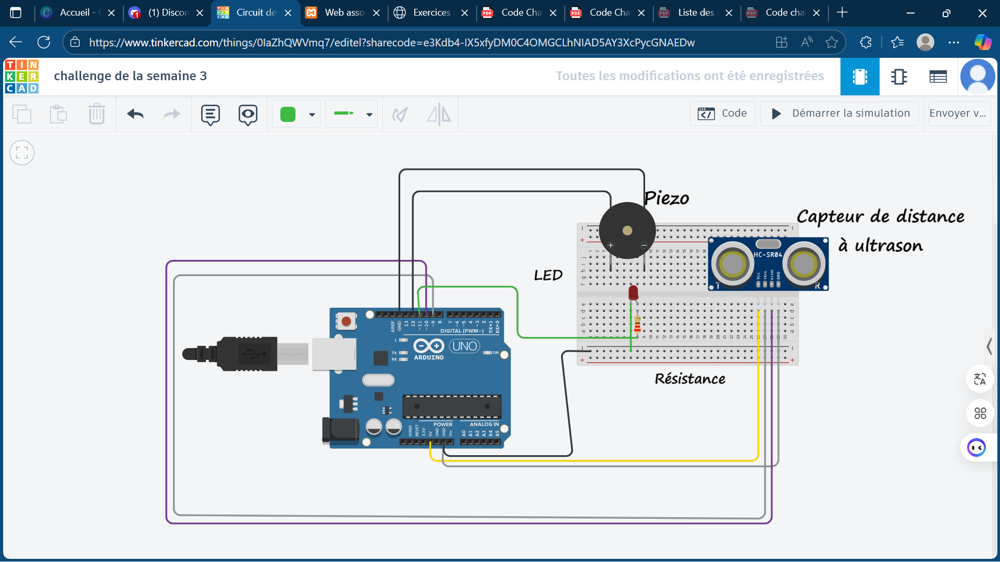

# Système d'Alerte de Proximité 

# Objectif
Créer un appareil simulé dans TinkerCad qui mesure la distance 
d'un obstacle et déclenche une alerte visuelle et sonore si celui-ci est trop proche. 
#  Composants Requis (sur TinkerCad): 
● 1 Arduino Uno R3 
● 1 Capteur de distance à ultrason (HC-SR04) 
● 1 LED (rouge)  
● 1 Piezo (buzzer)  
● 1 Résistance de 220 Ω  
● 1 Breadboard  

## Lien du projet sur TinkerCad
* https://www.tinkercad.com/things/0IaZhQWVmq7/editel?sharecode=e3Kdb4-IX5xfyDM0C4OMGCLhNIAD5AY3XcPycGNAEDw *

## Image annoté du capture du shéma TinkerCad

